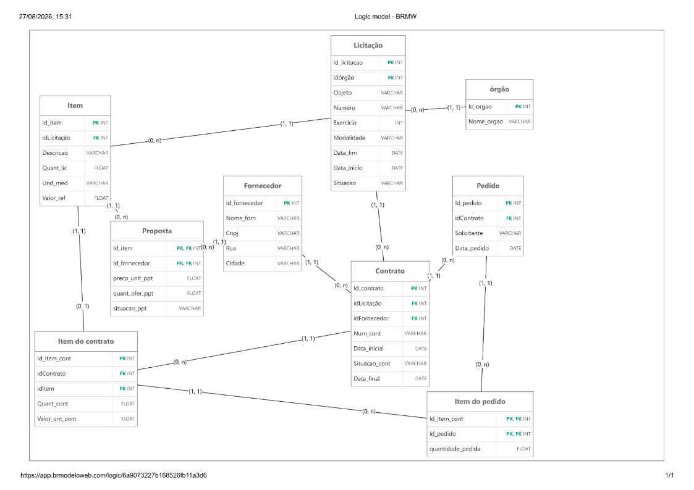

# Licitacoes DB Lab

Projeto de modelagem e implementacao de um banco de dados de licitacoes em
PostgreSQL. O banco representa o processo que vai do cadastro da licitacao e
de seus itens ate a formalizacao de contratos e o consumo das quantidades
contratadas por pedidos.

## Modelo de dados



O modelo possui nove tabelas:

| Tabela | Granularidade |
|---|---|
| `orgao` | Uma linha representa um orgao publico. |
| `licitacao` | Uma linha representa uma licitacao realizada por um orgao. |
| `item` | Uma linha representa um item colocado em disputa em uma licitacao. |
| `fornecedor` | Uma linha representa um fornecedor. |
| `proposta` | Uma linha representa a proposta de um fornecedor para um item licitado. |
| `contrato` | Uma linha representa um contrato originado por uma licitacao e firmado com um fornecedor. |
| `item_contrato` | Uma linha representa um item e suas condicoes dentro de um contrato. |
| `pedido` | Uma linha representa uma solicitacao vinculada a um contrato. |
| `item_pedido` | Uma linha representa a quantidade de um item contratado consumida por um pedido. |

O dicionario completo esta em
[`docs/dicionario-dados.md`](docs/dicionario-dados.md).

## Principais decisoes

- `proposta` usa a chave primaria composta `(id_item, id_fornecedor)`. Assim,
  um fornecedor nao pode apresentar duas propostas para o mesmo item.
- Um indice unico parcial permite apenas uma proposta com situacao
  `VENCEDORA` por item.
- A proposta vencedora e indicada explicitamente nos dados. O banco nao
  escolhe automaticamente o menor preco, pois o criterio de julgamento pode
  variar entre menor preco por item, lote ou valor global.
- `item_pedido` usa a chave primaria composta
  `(id_pedido, id_item_contrato)`, impedindo a repeticao do mesmo item em um
  pedido.
- `item_contrato` possui uma chave primaria simples e `UNIQUE (id_item)`. Neste
  modelo, um item licitado pode constar em, no maximo, um contrato.
- O saldo nao e armazenado. Ele e calculado pela quantidade contratada menos a
  soma das quantidades ja pedidas.
- A identificacao e a autorizacao do usuario solicitante pertencem a camada da
  aplicacao. Neste laboratorio, o pedido guarda apenas o nome do solicitante.

## Regras implementadas

As tabelas utilizam `PRIMARY KEY`, `FOREIGN KEY`, `NOT NULL`, `UNIQUE`,
`CHECK` e `DEFAULT` para garantir a integridade dos dados. As principais
regras sao:

- quantidades devem ser maiores que zero;
- precos e valores nao podem ser negativos;
- o CNPJ deve possuir exatamente 14 digitos e nao pode se repetir;
- datas de encerramento e termino nao podem ser anteriores as datas de inicio;
- cada licitacao e identificada unicamente por orgao, numero e exercicio;
- um contrato somente pode ser criado a partir de uma licitacao homologada;
- o item contratado deve pertencer a mesma licitacao do contrato;
- o fornecedor contratado deve possuir a proposta vencedora para o item;
- as quantidades ofertada e contratada nao podem ultrapassar a quantidade
  licitada;
- um pedido exige contrato ativo e data dentro da vigencia contratual;
- o item pedido deve pertencer ao mesmo contrato do pedido;
- a soma das quantidades pedidas nao pode ultrapassar a quantidade contratada.

As validacoes que dependem de mais de uma tabela sao realizadas por triggers.
A verificacao de saldo bloqueia o item contratado com `FOR UPDATE`, evitando
que pedidos concorrentes consumam o mesmo saldo simultaneamente.

## Estrutura do projeto

```text
licitacoes-db-lab/
|-- README.md
|-- docs/
|   |-- dicionario-dados.md
|   `-- modelo.png
`-- sql/
    |-- 01_schema.sql
    |-- 02_seed.sql
    |-- 03_queries.sql
    `-- 04_transactions.sql
```

## Pre-requisitos

- PostgreSQL 16 ou versao compativel;
- cliente de terminal `psql`;
- banco `licitacoes_db` e usuario `licitacoes_user` previamente criados.

Para testar a conexao:

```bash
psql -h localhost -U licitacoes_user -d licitacoes_db
```

## Como executar

Na raiz do projeto, execute os arquivos na ordem abaixo:

```bash
psql -v ON_ERROR_STOP=1 -h localhost -U licitacoes_user -d licitacoes_db -f sql/01_schema.sql
psql -v ON_ERROR_STOP=1 -h localhost -U licitacoes_user -d licitacoes_db -f sql/02_seed.sql
psql -v ON_ERROR_STOP=1 -h localhost -U licitacoes_user -d licitacoes_db -f sql/03_queries.sql
psql -v ON_ERROR_STOP=1 -h localhost -U licitacoes_user -d licitacoes_db -f sql/04_transactions.sql
```

A opcao `ON_ERROR_STOP=1` interrompe a execucao quando o PostgreSQL encontra
um erro. O arquivo de transacoes usa `\gset`, um recurso do `psql`, para
guardar o ID gerado para um pedido.

O `01_schema.sql` remove e recria toda a estrutura. O `02_seed.sql` limpa os
dados e reinicia as identidades antes de inserir a massa de teste. Portanto,
esses arquivos nao devem ser executados em um banco com dados que precisem ser
preservados.

## Dados de teste

O arquivo `02_seed.sql` insere:

- 2 orgaos;
- 3 licitacoes;
- 10 itens licitados;
- 5 fornecedores;
- 15 propostas;
- 3 contratos;
- 5 pedidos.

Um dos contratos e mantido sem pedidos para permitir a validacao da consulta
correspondente.

## Consultas

O arquivo `03_queries.sql` responde:

1. valor estimado de cada licitacao;
2. quantidade de fornecedores participantes por licitacao;
3. proposta vencedora de cada item;
4. diferenca entre os valores de referencia e contratado;
5. valor total de cada contrato;
6. quantidade e valor ja pedidos por item contratado;
7. saldo disponivel de cada item contratado;
8. contratos que nunca tiveram pedido;
9. fornecedor com maior valor contratado;
10. itens com economia superior a 10%.

## Transacoes

O `04_transactions.sql` possui dois exemplos:

- uma transacao que cadastra um pedido e seus itens e confirma as alteracoes
  com `COMMIT`;
- uma transacao que cadastra outro pedido e seus itens, mas desfaz todas as
  alteracoes com `ROLLBACK`.

O exemplo com `COMMIT` altera os dados de teste. O exemplo com `ROLLBACK` serve
para demonstrar que o pedido e seus itens sao desfeitos como uma unica
operacao.
